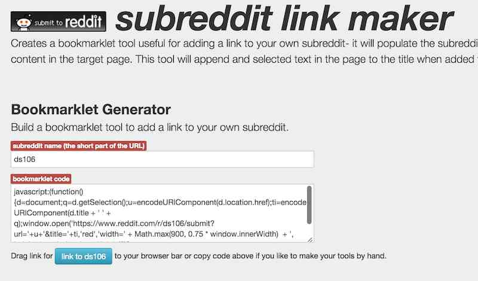
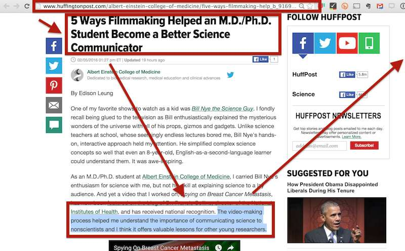
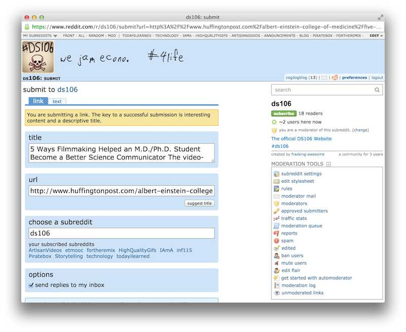
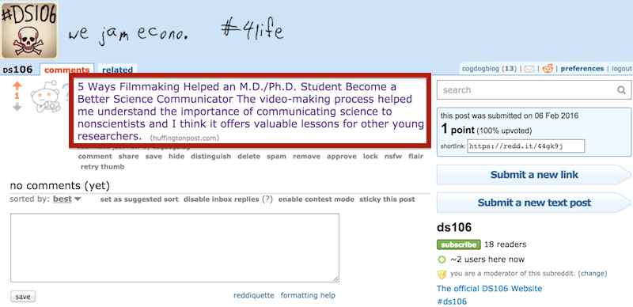

# Subreddit Bookmarklet Generator
by Alan Levine http://cog.dog/ or http://cogdogblog.com/

## What is this?
If you create a your own subreddit on reddit.com this tool offers an easy way to add links as you explore various web sites. The form on reddit is pretty easy to use already (you simply paste in a URL and it figures out the web site title), but I wanted to make it even smoother-- and offer a way to add additional text from the body of the site you are adding.

With this tool, you create your own browser bookmarklet, a link you add to your browser tool bar, that will let you add links to any subreddit you want to contribute to.

## Making Your Own Bookmarklet
First, to the Generator at http://cogdog.github.io/subreddit-link-maker/

In the forst form field, you need to enter the name of the subreddit you want to use. In the example below, it will add to the subreddit at https://www.reddit.com/r/ds106 so I enter `ds106`.

When you click out of this entry field, you should notice the name on the blue button change to match your entry. That's rather magical, eh?

Now, you just drag this blue button (it's just a link) to an empty area on your web browser's bookmarks bar (that is what it's called in Chrome and Firefox; it is the Favorites bar in Internet Explorer and Safari).

## Using the Bookmarklet
Go out on the web! Find something interesting, maybe for the DS106 rubreddit I want to add the article [5 Ways Filmmaking Helped an M.D./Ph.D. Student Become a Better Science Communicator](http://www.huffingtonpost.com/albert-einstein-college-of-medicine/five-ways-filmmaking-help_b_9169618.html). 

Reddit only uses the page title as information (there is no place to add notes or description), so if you want to add maybe another sentence as additional information, just highlight a key one in the original article.

Clicking your new Subreddit Bookmarklet will open a new window, with the information from the page you were viewing added to it- the URL is the link, the subreddit already entered, and the title and selected text are now combined in the title field.

You may of course edit this before clicking the `save` button at the bottom.

That's it! The new link has been added to your subreddit.

Now you can engage in dynamic comment conversation about this link.

## Postscript

I fully expect someone to tell me of an already built reddit tool for doing this. In many ways, it was an exercise in some Javascript, jQuery, and building a github site.

